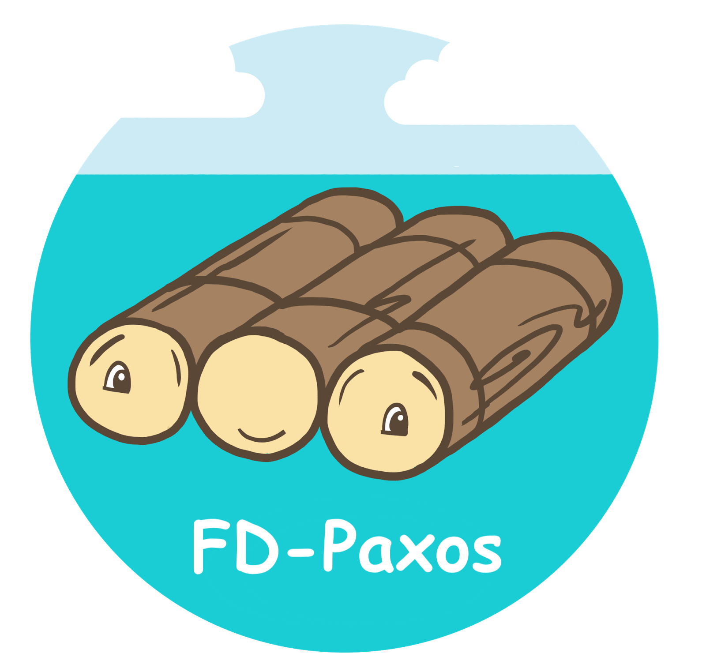
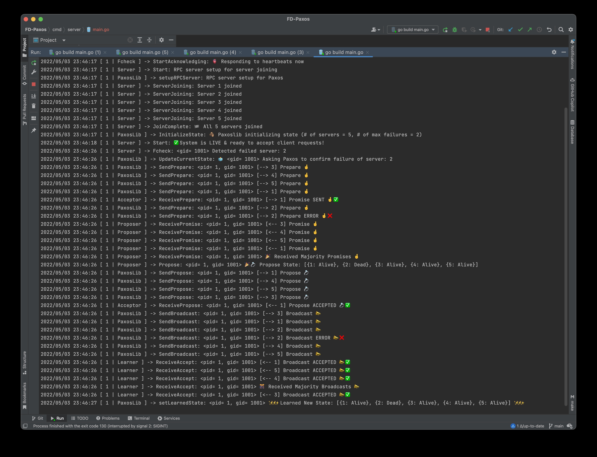

<!-- PROJECT LOGO  -->
<br />
<p align="center">
 <a href="https://github.com/sassansh/FD-Paxos">
    
  </a>
  <h2 align="center">Paxos Failure Detection</h2>

  <p align="center">
     Server Failure Detection with Paxos. Built as a group project for UBC's <a href="https://courses.students.ubc.ca/cs/courseschedule?pname=subjarea&tname=subj-course&dept=CPSC&course=416">CPSC 416</a> (Distributed Systems).
  </p>
</p>

<p align="center">
    
</p>

## Table of Contents

- [Project Spec 🎯](#project-spec-)
- [Final Report 📑](#final-report-)
- [Technology Stack 🛠️](#technology-stack-%EF%B8%8F)
- [Prerequisites 🍪](#prerequisites-)
- [Setup 🔧](#setup-)
- [Team 😁](#team-)

## Project Spec 🎯

For a PDF containing the project's specifications, please view [project-spec.pdf](https://github.com/sassansh/FD-Paxos/blob/main/project-spec.pdf).

## Final Report 📑

For a detailed final report written on the project, please view [final-report.pdf](https://github.com/sassansh/FD-Paxos/blob/main/final-report.pdf).

## Technology Stack 🛠️

[Go](https://go.dev)

## Prerequisites 🍪

You should have [GoLand](https://www.jetbrains.com/go/download/), [Go v1.18.1](https://go.dev/dl/) and [Git](https://git-scm.com/) installed on your PC.

## Setup 🔧

1. Clone the repo using:

   ```bash
     git clone https://github.com/sassansh/FD-Paxos.git
   ```

2. Open the project in GoLand.

3. First, start the tracing server by running:

   ```bash
     go run cmd/tracing-server/main.go
   ```

4. Next, start Servers 1-5 by running:

   ```bash
     go run cmd/server/main.go
     go run cmd/server2/main.go
     go run cmd/server3/main.go
     go run cmd/server4/main.go
     go run cmd/server5/main.go
   ```

5. Next, start the Client by running:

   ```bash
     go run cmd/client/main.go
   ```

6. Quit or kill one of the server processes and watch the Paxos algorithim run on the server's terminals.

7. The client should now be reporting that server as dead.

## Team 😁

Sassan Shokoohi - [GitHub](https://github.com/sassansh) - [LinkedIn](https://www.linkedin.com/in/sassanshokoohi/) - [Personal Website](https://sassanshokoohi.ca)

Naithan Bosse

Johnny Li

Felipe Caiado

Ken Utsunomiya

Jonathan Hirsch
